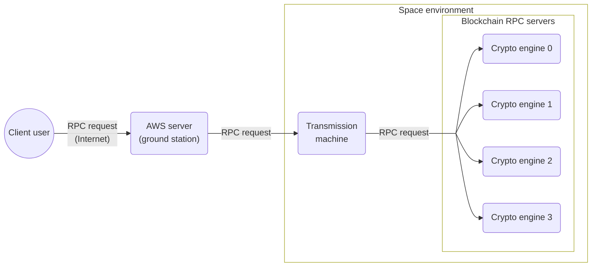

import { Steps, Callout } from 'nextra/components'

# Architecture

The testnet is mimicking operation in space, it actually runs on a set of ground hardware called flatsat. You are able to compile executable files locally and send transactions to the provided valid ports. Here is the architecture of Dear Doge Testnet:

Before interacting with the Dear Doge Testnet, you need to install the `dogd` client. Next, we will demonstrate how to install this client.
