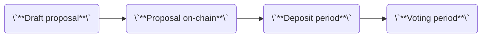

import { Steps, Callout } from 'nextra/components'

# Governance

When there is a proposal to make changes to the Dora Vota blockchain, the proposal has to go through governance. Unlike many other Cosmos appchains, Dora Vota does not have inflation or a token pool for distribution via governance. Therefore, governance on Dora Vota only focuses on changes to the blockchain itself and is voted on by Dora Vota’s validators.

Anyone can create a governance proposal on Dora Vota. To submit a governance proposal, you have to draft the proposal and propose it on-chain. To advance the proposal to the voting phase, a deposit is required.



## Submit a proposal

To submit a new proposal on Vota, you can send a transaction with the proposal details and a deposit amount. This deposit amount can be any amount, but until the overall deposit amount meets the `MinDeposit` (the minimum required to enter voting), the proposal will remain in the deposit period.

<Callout type="warning">
  A submit-proposal transaction must include a nonzero positive deposit amount.
</Callout>

You can execute the following command to submit a proposal:

```ansi filename="Terminal"
$ dorad tx gov submit-proposal path/to/proposal.json
```

Where the example `proposal.json` contains:

```json filename="proposal.json"
{
  // Array of proto-JSON-encoded sdk.Msgs
  "messages": [
    {
      "@type": "/cosmos.bank.v1beta1.MsgSend",
      "from_address": "dora1...",
      "to_address": "dora1...",
      "amount": [{ "denom": "peaka", "amount": "10" }]
    }
  ],
  // Metadata can be any of base64 encoded, raw text, stringified json, IPFS link to json
  // See below for example `metadata`
  "metadata": "4pIMOgIGx1vZGU=",
  "deposit": "10peaka",
  "title": "My proposal",
  "summary": "A short summary of my proposal"
}
```

An example of `metadata`:

```json
{
  "title": "",
  "authors": [""],
  "summary": "",
  "details": "",
  "proposal_forum_url": "",
  "vote_option_context": ""
}
```

### Example: a proposal to update max validator set

Here we will show an example about how to change the max validator set size. You can edit the `proposal.json` like this:

```json filename="proposal.json"
{
  "title": "Param change for MaxValidators",
  "description": "Increasing the MaxValidators parameter",
  "summary": "Update validator set",
  "metadata": "xxxx",
  "messages": [
    {
      "@type": "/cosmos.staking.v1beta1.MsgUpdateParams",
      "authority": "dora10d07y265gmmuvt4z0w9aw880jnsr700jeckgp9",
      "params": {
        "bond_denom": "peaka",
        "historical_entries": "10000",
        "max_entries": "7",
        "max_validators": "100",
        "min_commission_rate": "0.000000000000000000",
        "unbonding_time": "1814400s"
      }
    }
  ],
  "deposit": "100000000000000000000000peaka"
}
```

The above proposal changes the `max_validators` to `100` and the other parameter `staking` is unchanged. `authority` is the gov module account of Vota Mainnet that has the authority to modify the parameters of the `staking` module.

## Query for proposal information

You can also view existing proposal details and the state of the proposal (deposit period, voting period, etc) by querying for a specific proposal id with this command:

```ansi filename="Terminal"
$ dorad query gov proposal {proposal_id}
```

You can also query for the proposer for a specified proposal to view the address that initially submitted the proposal:

```ansi filename="Terminal"
$ dorad query gov proposer {proposal_id}
```

## Deposit to a proposal

If a created proposal is in deposit period, you can add deposit to that proposal so that it could enter the voting period.

<Callout type="error">
  If a proposal fails to meet `MinDeposit` before the deposit period ends, **all
  deposits will be burned**. The `MinDeposit` of Vota Mainnet is
  **100,000,000,000,000,000,000,000 peaka**, i.e., **100,000 DORA**.
</Callout>

You can execute this command to contribute deposit to anyone proposal:

```ansi filename="Terminal"
$ dorad tx gov deposit {proposal_id} {deposit_amount} --from {your_key}
```

## Query for deposit status

A user can query for a deposit made by a specific address on a specific proposal. This can be used to see your current deposit amount or to see the amount another account deposited.

```ansi filename="Terminal"
$ dorad query gov deposit {proposal_id} {depositor_addr}
```

You can also query all deposits made for a proposal with a separate query command:

```ansi filename="Terminal"
$ dorad query gov deposits {proposal_id}
```

## Vote for a proposal

This allows an address to vote on a specified proposal. There are four voting options:

- `yes`
- `no`
- `abstain`
- `no_with_veto`

You can vote with this command:

```ansi filename="Terminal"
$ dorad tx gov vote {proposal_id} {vote_option} --from {voter_key}
```

## Query for proposal status

Use the following command to return the current vote tally for a `proposal_id` provided:

```ansi filename="Terminal"
$ dorad query gov tally {proposal_id}
```

Use this command to return all the votes on the specified proposal:

```ansi filename="Terminal"
$ dorad query gov votes {proposal_id}
```
